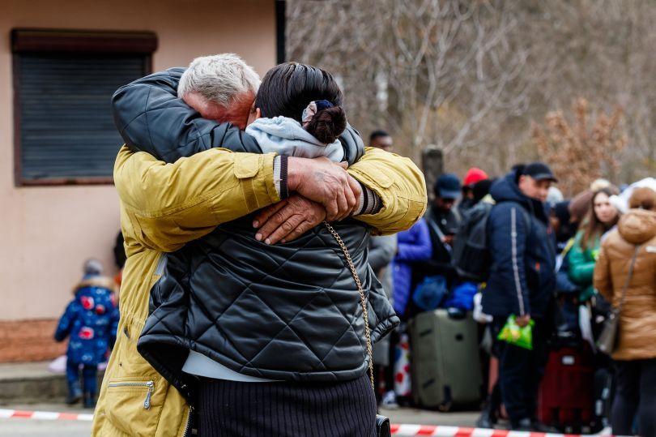

# LOST & FOUND 
### React.js app
*is an eco-system that leverages technology to build on the foundation of paying it forward!*

It's also my capstone project for BrainStation's full-stack bootcamp. We were tasked to ideate, plan, and execute a full-stack application within two weeks. Lost&Found was made using create-react-app, react-router, axios, react-burger-menu, react-select, swiper and SASS for the front end, a Node/Express backend API leveraging Passport.js & the passport-google-Oauth2 strategy for authentication, and Knex to migrate, seed and query a MySQL database. At least for now. We'll see how things change as I continue to build on it.

Below are instructions on how to install the React.js front-end app. If you
haven't already, please install the back-end Node/Express API server first.
[click here](https://github.com/kirill-develops/lost-and-found-server) to find
the repo and instruction.

 [Click here ](http://linktomyvideo.com)to watch my demo presentation.

 Thanks for stopping by. 💫 

 -Kirill (06-04-2022)

# Installation
 Follow these steps to run a local instance of Lost&Found:
> You'll need google App credentials and node, npm, and MySQL already installed.
#### **Set up the back-end**
1. Please goto the
   [lost-and-found-server](https://github.com/kirill-develops/lost-and-found-server) repo
#### **Set up the front-end**
2. Clone or download this repo.
3. Install client dependencies:
   >Run `npm install` from inside the client directory.

        $ cd lost-and-found-client
        $ npm install
4. Start the React app:

        $ npm start